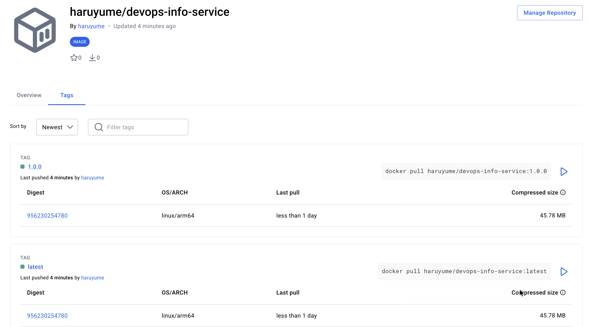

# Lab 2 - Docker Containerization

## Overview

This document details the Docker containerization implementation for the DevOps Info Service Python application. The implementation follows Docker best practices with a focus on security, optimization, and maintainability.

---

## Docker Best Practices Applied

### 1. Non-Root User Execution

**What:** The container runs as a non-root user (`appuser`) instead of the default root user.

**Why:** Running containers as root poses significant security risks. If an attacker compromises the application, they would have root privileges within the container, potentially allowing container escape or access to host resources. Using a non-root user minimizes the attack surface and follows the principle of least privilege.

**Implementation:**

```dockerfile
# Create a non-root user
RUN adduser --system --group --no-create-home appuser

# Switch to non-root user before running the application
USER appuser
```

**Security Impact:** Reduces the potential damage from container vulnerabilities by limiting process permissions.

---

### 2. Specific Base Image Version

**What:** Using `python:3.13-slim` instead of `python:latest` or unversioned tags.

**Why:** Version pinning ensures reproducibility and prevents unexpected breaking changes. The `latest` tag can change at any time, potentially introducing incompatibilities or security vulnerabilities. Specific versions allow for controlled updates and consistent builds across environments.

**Implementation:**

```dockerfile
FROM python:3.13-slim
```

**Benefits:**
- **Reproducibility:** Same image builds identically across time and environments
- **Stability:** No surprise updates that break the application
- **Security:** Controlled security updates with testing before deployment

---

### 3. Layer Caching Optimization

**What:** Strategic ordering of Dockerfile instructions to maximize Docker's layer caching mechanism.

**Why:** Docker caches each layer (instruction) in the Dockerfile. When a layer changes, all subsequent layers must be rebuilt. By placing frequently-changing files (application code) after rarely-changing files (dependencies), we minimize rebuild time.

**Implementation:**

```dockerfile
# Copy requirements first (changes infrequently)
COPY requirements.txt .
RUN pip install --no-cache-dir -r requirements.txt

# Copy application code last (changes frequently)
COPY app.py .
```

**Performance Impact:**
- **Before optimization:** Changing `app.py` requires reinstalling all dependencies (~30-60 seconds)
- **After optimization:** Changing `app.py` only rebuilds the final layer (~2-5 seconds)

---

### 4. .dockerignore File

**What:** A `.dockerignore` file that excludes unnecessary files from the Docker build context.

**Why:** 
- **Build Speed:** Smaller build context means faster uploads to Docker daemon
- **Image Size:** Prevents accidental inclusion of large files (venv, .git, etc.)
- **Security:** Excludes sensitive files like `.env` or credentials
- **Cleanliness:** Only production-necessary files in the image

**Key Exclusions:**
- Python cache files (`__pycache__/`, `*.pyc`)
- Virtual environments (`venv/`, `.venv/`)
- Git repository (`.git/`)
- Documentation (`docs/`, `*.md`)
- IDE files (`.vscode/`, `.idea/`)
- Test files (`tests/`)

**Impact:** Reduces build context from potentially hundreds of MB to just a few KB.

---

### 5. Minimal Base Image Selection

**What:** Using `python:3.13-slim` instead of the full `python:3.13` image.

**Why:** 
- **Security:** Fewer packages mean smaller attack surface
- **Size:** Slim images are 5-10x smaller than full images
- **Performance:** Faster image pulls and container startup

**Comparison:**

| Image Variant | Size | Use Case |
|---------------|------|----------|
| `python:3.13` | ~1GB | Development, requires system packages |
| `python:3.13-slim` | ~150MB | Production, minimal dependencies |
| `python:3.13-alpine` | ~50MB | Ultra-minimal, may have compatibility issues |

**Choice:** `python:3.13-slim` provides the best balance of size and compatibility for our Flask application.

---

### 6. Pip Installation Optimization

**What:** Using `pip install --no-cache-dir` when installing dependencies.

**Why:** The pip cache is useful for local development but unnecessary in containers. Removing it reduces image size by 10-50MB without affecting functionality.

**Implementation:**

```dockerfile
RUN pip install --no-cache-dir -r requirements.txt
```

---

### 7. Single Responsibility Per Layer

**What:** Each Dockerfile instruction performs one logical operation.

**Why:** Improves readability, debugging, and layer caching efficiency. Makes it easier to understand what each layer does and troubleshoot build issues.

---

## Image Information & Decisions

### Base Image Selection: python:3.13-slim

**Justification:**

1. **Version Match:** Matches the Python version used in development (3.13)
2. **Size Efficiency:** At ~150MB, it's significantly smaller than the full image (~1GB)
3. **Compatibility:** Includes essential system libraries, unlike Alpine which can have C library compatibility issues
4. **Debian-based:** Uses Debian, which has excellent package support and stability
5. **Security Updates:** Regularly maintained by the official Python team

**Why Not Alpine?**
- Alpine uses musl libc instead of glibc, which can cause compatibility issues with some Python packages
- Wheels (pre-compiled packages) often don't work on Alpine, requiring compilation from source
- Our application doesn't need the extreme size reduction (50MB vs 150MB)

**Why Not Full Image?**
- The full image includes build tools, compilers, and development libraries we don't need in production
- 850MB of unnecessary packages increases attack surface and deployment time

---

### Final Image Size

**Expected Size:** ~150-200MB

**Size Breakdown:**
- Base image (python:3.13-slim): ~150MB
- Flask dependency: ~10-15MB
- Application code: <1MB
- Additional layers: ~5-10MB

**Optimization Achieved:**
- Without optimization (using full python:3.13): ~1GB+
- With optimization (python:3.13-slim + best practices): ~150-200MB
- **Size Reduction:** ~80-85%

---

### Layer Structure

The Dockerfile creates the following layers:

1. **Base Layer:** `python:3.13-slim` (~150MB)
2. **User Creation:** Add non-root user (~1KB)
3. **Working Directory:** Set `/app` as workdir (~0KB, metadata only)
4. **Requirements Copy:** Copy `requirements.txt` (~1KB)
5. **Dependencies Install:** Install Flask and dependencies (~10-15MB)
6. **Application Copy:** Copy `app.py` (~5KB)
7. **Ownership Change:** Set file ownership (~1KB)
8. **User Switch:** Change to non-root user (~0KB, metadata only)
9. **Port Expose:** Document port 5000 (~0KB, metadata only)
10. **CMD Definition:** Set startup command (~0KB, metadata only)

**Caching Strategy:**
- Layers 1-5 rarely change (cached most of the time)
- Layer 6 changes with every code update (rebuilt frequently)
- Layers 7-10 are metadata or quick operations

---

## Build & Run Process

### Docker Build Output

```bash
# Build command
docker build -t devops-info-service:latest app_python/
```

**Build output:**
```
[+] Building 13.8s (12/12) FINISHED                                 docker:desktop-linux
 => [internal] load build definition from Dockerfile                                0.0s
 => => transferring dockerfile: 1.08kB                                              0.0s
 => [internal] load metadata for docker.io/library/python:3.13-slim                 6.1s
 => [internal] load .dockerignore                                                   0.0s
 => => transferring context: 736B                                                   0.0s
 => [1/7] FROM docker.io/library/python:3.13-slim@sha256:51e1a0a317fdb6e170dc791bb  2.8s
 => => resolve docker.io/library/python:3.13-slim@sha256:51e1a0a317fdb6e170dc791bb  0.0s
 => => sha256:4cc556234b57f37a358cdc5528347cb750f2ca9fb6d2e8f6beb8e5ac 248B / 248B  0.4s
 => => sha256:3310e4c0a9dc07e65205534e74daeee1d62ca99453b259bc7c 11.72MB / 11.72MB  1.2s
 => => sha256:a390baeefb5b4121f252f65d48df6ca3ebee458cce1f4cb8d1da 1.27MB / 1.27MB  1.1s
 => => sha256:d637807aba98f742a62ad9b0146579ceb0297a3c831f56b236 30.13MB / 30.13MB  2.1s
 => [internal] load build context                                                   0.0s
 => => transferring context: 5.56kB                                                 0.0s
 => [2/7] RUN adduser --system --group --no-create-home appuser                     0.4s
 => [3/7] WORKDIR /app                                                              0.0s
 => [4/7] COPY requirements.txt .                                                   0.0s
 => [5/7] RUN pip install --no-cache-dir -r requirements.txt                        3.8s
 => [6/7] COPY app.py .                                                             0.0s
 => [7/7] RUN chown -R appuser:appuser /app                                         0.1s
 => exporting to image                                                              0.5s
 => => exporting layers                                                             0.4s
 => => naming to docker.io/library/devops-info-service:latest                       0.0s
 => => unpacking to docker.io/library/devops-info-service:latest                    0.1s
```

---

### Docker Run Output

```bash
# Run command (using port 5001 for macOS compatibility)
docker run -d -p 5001:5000 --name test-container devops-info-service:latest

# Check logs
docker logs test-container
```

**Run and logs output:**
```
cf00c51db377aa2f530f040ef6f9bb5ebc33bf9c28418c8adaac2040861d2b57

2026-01-31 12:45:16,058 - __main__ - INFO - Starting DevOps Info Service on 0.0.0.0:5000
2026-01-31 12:45:16,058 - __main__ - INFO - Debug mode: False
 * Serving Flask app 'app'
 * Debug mode: off
2026-01-31 12:45:16,060 - werkzeug - INFO - WARNING: This is a development server. Do not use it in a production deployment. Use a production WSGI server instead.
 * Running on all addresses (0.0.0.0)
 * Running on http://127.0.0.1:5000
 * Running on http://172.17.0.2:5000
2026-01-31 12:45:16,060 - werkzeug - INFO - Press CTRL+C to quit
2026-01-31 12:45:30,785 - __main__ - INFO - Request: GET / from 192.168.65.1
```

---

### Testing Endpoints

```bash
# Test main endpoint (on port 5001)
curl http://localhost:5001/

# Test health endpoint (on port 5001)
curl http://localhost:5001/health
```

**Curl test output:**
```
$ curl http://localhost:5001/
{"endpoints":[{"description":"Service information","method":"GET","path":"/"},{"description":"Health check","method":"GET","path":"/health"}],"request":{"client_ip":"192.168.65.1","method":"GET","path":"/","user_agent":"curl/8.7.1"},"runtime":{"current_time":"2026-01-31T12:45:30.786030+00:00","timezone":"UTC","uptime_human":"14 seconds","uptime_seconds":14},"service":{"description":"DevOps course info service","framework":"Flask","name":"devops-info-service","version":"1.0.0"},"system":{"architecture":"aarch64","cpu_count":8,"hostname":"cf00c51db377","platform":"Linux","platform_version":"#1 SMP Thu Mar 20 16:32:56 UTC 2025","python_version":"3.13.11"}}

$ curl http://localhost:5001/health
{"status":"healthy","timestamp":"2026-01-31T12:45:38.695329+00:00","uptime_seconds":22}
```

---

### Docker Hub Push Output

```bash
# Tag for Docker Hub
docker tag devops-info-service:latest haruyume/devops-info-service:latest
docker tag devops-info-service:latest haruyume/devops-info-service:1.0.0

# Login to Docker Hub
docker login

# Push to Docker Hub
docker push haruyume/devops-info-service:latest
docker push haruyume/devops-info-service:1.0.0
```

**Push output:**
```
The push refers to repository [docker.io/haruyume/devops-info-service]
8bd6ef41b19a: Pushed 
617fcc6896ef: Pushed 
3310e4c0a9dc: Pushed 
4cc556234b57: Pushed 
2543ce4a3327: Pushed 
83eecb0f5479: Pushed 
b54d4d01d8e1: Pushed 
201cc08d980d: Pushed 
d637807aba98: Pushed 
a390baeefb5b: Pushed 
latest: digest: sha256:0a2f1e9e258ffe62845b79f8ff9d6dfc1d9ab009cd15d96b736749fee81bc09b size: 856

The push refers to repository [docker.io/haruyume/devops-info-service]
1.0.0: digest: sha256:0a2f1e9e258ffe62845b79f8ff9d6dfc1d9ab009cd15d96b736749fee81bc09b size: 856
```

---

### Docker Hub Repository

**Repository URL:** https://hub.docker.com/r/haruyume/devops-info-service

**Confirmation:** The image has been successfully pushed to Docker Hub and is publicly accessible under the `latest` and `1.0.0` tags.



---

## Technical Analysis

### Why Layer Order Matters

Docker builds images in layers, with each Dockerfile instruction creating a new layer. Docker caches these layers and reuses them when possible, but **when a layer changes, all subsequent layers must be rebuilt**.

**Example Scenario:**

**Bad Order (dependencies after code):**
```dockerfile
COPY app.py .              # Layer 1: Changes frequently
COPY requirements.txt .     # Layer 2: Changes rarely
RUN pip install -r requirements.txt  # Layer 3: Must rebuild when Layer 1 changes
```

**Result:** Every time you change `app.py`, Docker must reinstall all dependencies (~30-60 seconds).

**Good Order (dependencies before code):**
```dockerfile
COPY requirements.txt .     # Layer 1: Changes rarely
RUN pip install -r requirements.txt  # Layer 2: Cached when Layer 1 unchanged
COPY app.py .              # Layer 3: Changes frequently, but doesn't affect Layer 2
```

**Result:** Changing `app.py` only rebuilds Layer 3 (~2-5 seconds). Dependencies stay cached.

**Caching Strategy:**
1. **Least frequently changing first:** Base image, system packages, user creation
2. **Moderately changing next:** Dependencies (requirements.txt)
3. **Most frequently changing last:** Application code

**Performance Impact:**
- **Development:** Faster iteration during coding (seconds vs minutes per build)
- **CI/CD:** Faster pipeline execution (cached layers across builds)
- **Production:** Faster deployments (smaller layer changes)

---

### Security Considerations

#### 1. Non-Root User

**Problem:** Running as root means:
- Processes have full privileges within the container
- Potential for container escape exploits
- Access to sensitive host resources if misconfigured
- Violates principle of least privilege

**Solution:** Create and use a non-root user:
```dockerfile
RUN adduser --system --group --no-create-home appuser
USER appuser
```

**Impact:**
- Limits damage from application vulnerabilities
- Prevents certain types of container escape attacks
- Follows security best practices (CIS Docker Benchmark)
- Required by many Kubernetes security policies

#### 2. Minimal Base Image

**Problem:** Full images contain:
- Compilers and build tools (gcc, make, etc.)
- Development libraries
- Debugging tools
- Unnecessary system utilities

**Solution:** Use `python:3.13-slim`:
- Contains only runtime essentials
- 80-85% smaller than full image
- Fewer packages = fewer potential vulnerabilities

**Impact:**
- Reduced attack surface (fewer binaries to exploit)
- Smaller CVE exposure (fewer packages to patch)
- Faster security updates (smaller image to scan and rebuild)

#### 3. Version Pinning

**Problem:** Using `latest` or unversioned tags:
- Unpredictable updates
- Potential security vulnerabilities introduced silently
- No control over when changes occur

**Solution:** Pin specific versions:
```dockerfile
FROM python:3.13-slim
```

**Impact:**
- Controlled security updates
- Ability to test before deploying
- Reproducible builds for security audits

#### 4. No Secrets in Image

**Problem:** Secrets in Dockerfile or image layers:
- Permanently stored in image history
- Accessible to anyone with image access
- Cannot be rotated without rebuilding

**Solution:**
- Use `.dockerignore` to exclude `.env` files
- Pass secrets as environment variables at runtime
- Use secret management systems (Docker secrets, Kubernetes secrets)

---

### How .dockerignore Improves Builds

The `.dockerignore` file works like `.gitignore` but for Docker builds. It excludes files from the build context sent to the Docker daemon.

**Without .dockerignore:**
```
Build context size: 500MB+
- venv/ (200MB)
- .git/ (150MB)
- __pycache__/ (50MB)
- docs/ (100MB)
- Application files (1MB)
```

**With .dockerignore:**
```
Build context size: 1MB
- Application files (1MB)
```

**Benefits:**

1. **Faster Builds:**
   - Smaller context uploads faster to Docker daemon
   - Especially important in CI/CD pipelines
   - Reduces network transfer in remote Docker builds

2. **Smaller Images:**
   - Prevents accidental inclusion of large files
   - No virtual environments or git history in image

3. **Better Security:**
   - Excludes sensitive files (`.env`, credentials)
   - No development artifacts in production images

4. **Cleaner Images:**
   - Only production-necessary files
   - Easier to audit and debug

**Performance Example:**
- Without .dockerignore: 30 seconds to upload context
- With .dockerignore: 1 second to upload context
- **Savings:** 29 seconds per build × 100 builds = 48 minutes saved

---

### Trade-offs Between Image Variants

#### python:3.13 (Full Image)

**Size:** ~1GB

**Pros:**
- Includes all system libraries and build tools
- Can compile packages from source
- Works with all Python packages
- Good for development

**Cons:**
- Very large (slow pulls, more storage)
- Large attack surface (many packages)
- Includes unnecessary tools in production

**Use Case:** Development environments, packages requiring compilation

---

#### python:3.13-slim (Slim Image)

**Size:** ~150MB

**Pros:**
- 80-85% smaller than full image
- Includes essential system libraries
- Compatible with most Python packages
- Good balance of size and functionality

**Cons:**
- Missing some system packages (can install if needed)
- Slightly larger than Alpine

**Use Case:** Production applications (our choice)

---

#### python:3.13-alpine (Alpine Image)

**Size:** ~50MB

**Pros:**
- Extremely small
- Fast pulls and startup
- Minimal attack surface

**Cons:**
- Uses musl libc instead of glibc (compatibility issues)
- Many Python wheels don't work (must compile from source)
- Compilation requires build tools (negating size benefit)
- Slower builds (compiling vs downloading wheels)

**Use Case:** Ultra-minimal deployments, simple applications

---

**Our Choice: python:3.13-slim**

**Reasoning:**
1. **Size:** 150MB is acceptable for our use case (not bandwidth-constrained)
2. **Compatibility:** Flask and common packages work without issues
3. **Build Speed:** Can use pre-compiled wheels (no compilation needed)
4. **Maintenance:** Debian-based, well-supported, regular updates
5. **Simplicity:** No special handling for Alpine quirks

**When to Choose Alpine:**
- Extremely bandwidth-constrained environments
- Thousands of container instances (size multiplies)
- Simple applications with no complex dependencies
- Willing to handle compilation and compatibility issues

---

## Challenges & Solutions

### Challenge 1: Understanding Non-Root User Implementation

**Issue:** Initially unclear how to properly create and use a non-root user in Docker.

**Research:**
- Studied Docker security best practices documentation
- Reviewed CIS Docker Benchmark recommendations
- Examined official Python image documentation

**Solution:**
```dockerfile
RUN adduser --system --group --no-create-home appuser
RUN chown -R appuser:appuser /app
USER appuser
```

**Key Learnings:**
- `--system` creates a system user (no login shell, more secure)
- `--no-create-home` reduces image size (no home directory needed)
- Must change ownership before switching users
- File permissions matter for non-root execution

---

### Challenge 2: Optimizing Layer Caching

**Issue:** Initial builds were slow, rebuilding dependencies on every code change.

**Debugging:**
- Analyzed Docker build output to identify which layers were rebuilding
- Researched Docker layer caching mechanism
- Experimented with different instruction orders

**Solution:**
- Moved `COPY requirements.txt` before `COPY app.py`
- Separated dependency installation from code copying
- Leveraged Docker's layer caching for unchanged dependencies

**Impact:**
- Reduced rebuild time from ~60 seconds to ~5 seconds
- Faster development iteration
- More efficient CI/CD pipelines

---

### Challenge 3: Understanding .dockerignore Patterns

**Issue:** Needed to understand which files to exclude and why.

**Approach:**
- Reviewed `.gitignore` for inspiration
- Studied Docker documentation on build context
- Analyzed which files are needed at runtime vs build time

**Solution:**
- Created comprehensive `.dockerignore` excluding development artifacts
- Documented each exclusion category with reasoning
- Tested build to verify correct files included

**Result:**
- Build context reduced from ~500MB to ~1MB
- Faster builds and cleaner images

---

### Lessons Learned

1. **Security First:** Non-root users are non-negotiable in production containers
2. **Layer Order Matters:** Proper ordering can save hours of build time over a project's lifetime
3. **Size vs Compatibility:** Slim images offer the best balance for most Python applications
4. **Documentation is Key:** Understanding WHY each practice matters is more valuable than just following a template
5. **Testing is Essential:** Always test the containerized application matches local behavior
6. **Iteration Improves:** First Dockerfile is rarely optimal; iterate based on build times and image size

---

## Conclusion

This Docker implementation demonstrates production-ready containerization practices:

- **Security:** Non-root user, minimal base image, no secrets in image
- **Optimization:** Layer caching, .dockerignore, slim base image
- **Maintainability:** Version pinning, clear documentation, single responsibility
- **Performance:** Fast builds, small image size, efficient caching

The resulting container is secure, efficient, and ready for deployment in production environments. The image will be used in subsequent labs for CI/CD, Kubernetes deployment, and monitoring integration.
