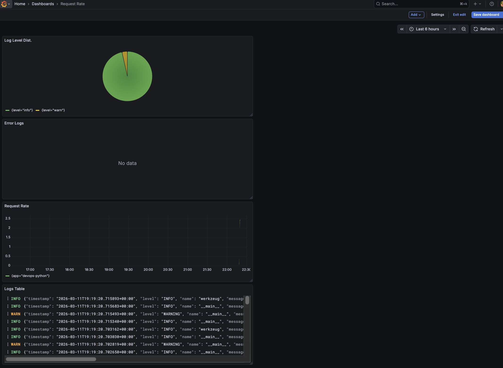
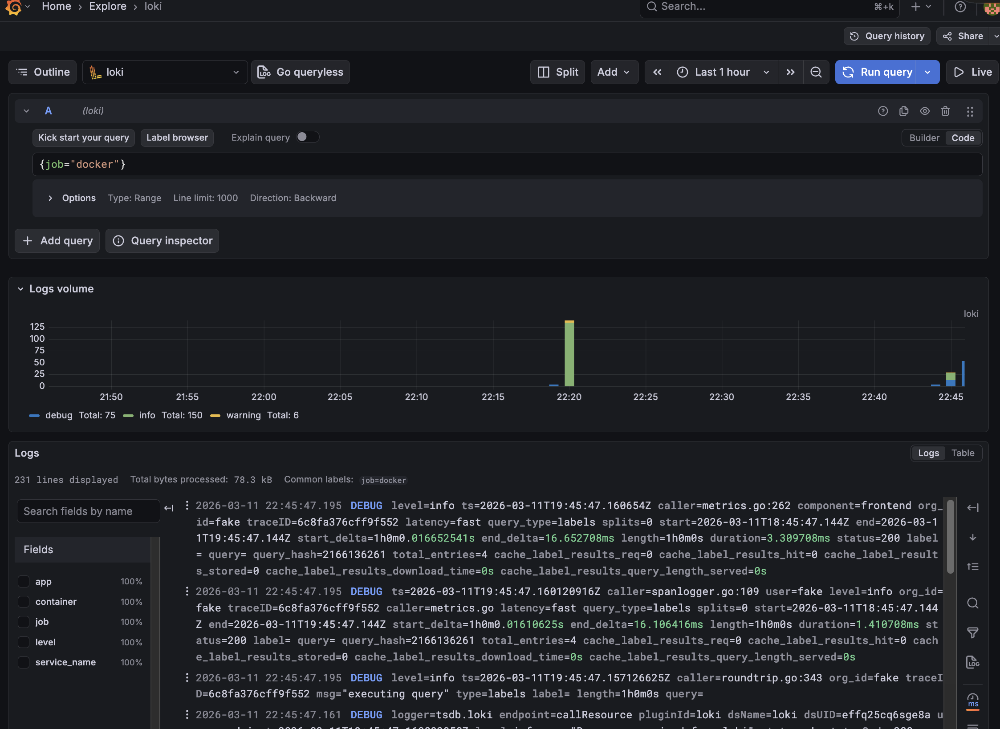
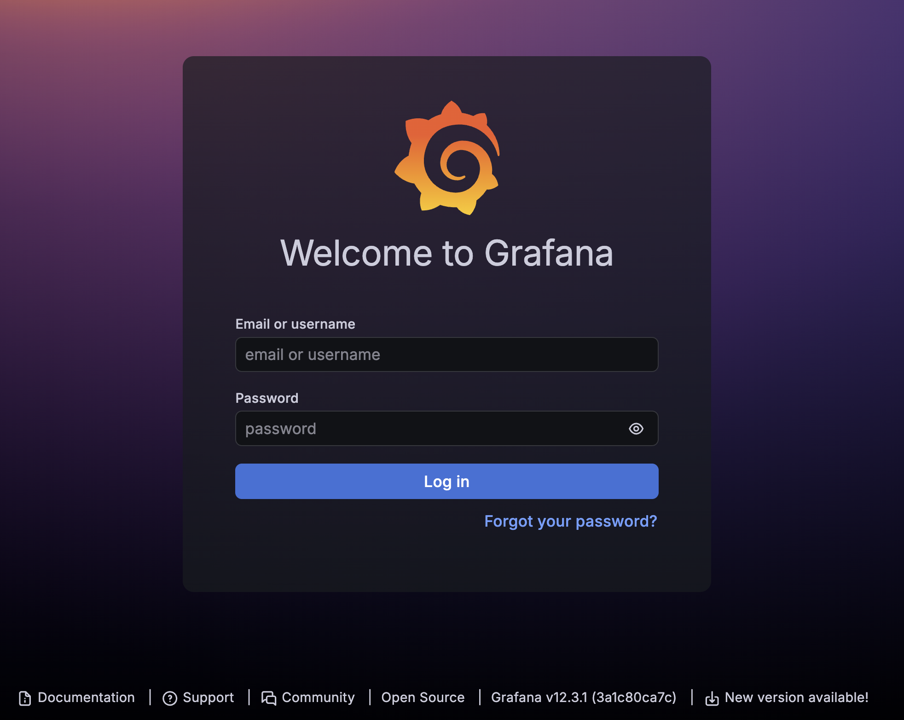

# Lab 7 — Observability & Logging with Loki Stack

## Architecture

```
┌──────────────┐     ┌──────────────┐     ┌──────────────┐
│  app-python  │     │   Promtail   │     │     Loki     │
│  (Flask App) │────▶│ (Log Shipper)│────▶│ (Log Storage)│
│  :8000→5000  │     │              │     │    :3100     │
└──────────────┘     └──────────────┘     └──────┬───────┘
                            │                     │
                  Docker Socket + Container       │
                  logs (read-only)                │
                                            ┌─────▼──────┐
                                            │  Grafana   │
                                            │ (Dashboard)│
                                            │   :3000    │
                                            └────────────┘
```

**Data Flow:**

1. **app-python** writes JSON-structured logs to stdout
2. **Promtail** discovers containers via Docker socket, reads their log files
3. Promtail ships logs to **Loki** via HTTP push API
4. **Grafana** queries Loki to visualize and explore logs

All services communicate over a shared Docker `logging` bridge network.

---

## Setup Guide

### Prerequisites

- Docker Desktop installed and running
- Docker image `haruyume/devops-info-service:latest` built and pushed

### Deployment

```bash
# Navigate to monitoring directory
cd monitoring

# Start all services
docker compose up -d

# Verify all services are healthy
docker compose ps
```

### Verify Services

```bash
# Test Loki readiness
curl http://localhost:3100/ready

# Test Grafana health
curl http://localhost:3000/api/health

# Test Python app
curl http://localhost:8000/
curl http://localhost:8000/health
```

### Configure Grafana Data Source

1. Open <http://localhost:3000> (login: `admin` / password from `.env`)
2. Go to **Connections** → **Data sources** → **Add data source** → **Loki**
3. URL: `http://loki:3100`
4. Click **Save & Test** — should show "Data source connected"

---

## Configuration

### Loki (`loki/config.yml`)

- **Storage engine:** TSDB (Time Series Database) — the recommended backend for Loki 3.0, providing up to 10x faster queries than the legacy boltdb-shipper
- **Schema:** v13 — latest schema version with optimal TSDB support
- **Object store:** Filesystem — suitable for single-instance deployments
- **Retention:** 168h (7 days) — automatically deletes logs older than 7 days
- **Compactor:** Enabled with 10-minute interval — handles retention enforcement and index compaction

```yaml
schema_config:
  configs:
    - from: "2024-01-01"
      store: tsdb
      object_store: filesystem
      schema: v13
      index:
        prefix: loki_index_
        period: 24h
```

### Promtail (`promtail/config.yml`)

- **Service discovery:** Docker SD via Unix socket — automatically discovers running containers
- **Filter:** Only scrapes containers with label `logging=promtail`
- **Relabeling:** Extracts container name (strips leading `/`) as `container` label, and copies `app` label from Docker container labels

```yaml
scrape_configs:
  - job_name: docker
    docker_sd_configs:
      - host: unix:///var/run/docker.sock
        refresh_interval: 5s
        filters:
          - name: label
            values: ["logging=promtail"]
    relabel_configs:
      - source_labels: ["__meta_docker_container_name"]
        regex: "/?(.*)"
        target_label: "container"
      - source_labels: ["__meta_docker_container_label_app"]
        target_label: "app"
      - target_label: "job"
        replacement: "docker"
```

### Docker Compose

- **Network:** All services on shared `logging` bridge network
- **Volumes:** Named volumes `loki-data` and `grafana-data` for data persistence
- **Dependencies:** Promtail and Grafana wait for Loki to be healthy before starting
- **Security:** Grafana admin password loaded from `.env` file (not committed to repo)

---

## Application Logging

### JSON Structured Logging

The Python Flask app uses `python-json-logger` to output structured JSON logs to stdout.

**Implementation:**

```python
from pythonjsonlogger import jsonlogger

class CustomJsonFormatter(jsonlogger.JsonFormatter):
    def add_fields(self, log_record, record, message_dict):
        super().add_fields(log_record, record, message_dict)
        log_record['timestamp'] = datetime.now(timezone.utc).isoformat()
        log_record['level'] = record.levelname
        log_record['logger'] = record.name
```

**HTTP request/response logging** is implemented via Flask hooks:

- `@app.before_request` — logs method, path, client_ip, user_agent
- `@app.after_request` — logs method, path, status_code, client_ip

**Example JSON log output:**

```json
{"timestamp": "2026-03-11T19:19:20.702650+00:00", "level": "INFO", "name": "__main__", "message": "Incoming request", "method": "GET", "path": "/nonexistent", "client_ip": "192.168.65.1", "user_agent": "curl/8.7.1", "logger": "__main__"}
{"timestamp": "2026-03-11T19:19:20.702819+00:00", "level": "WARNING", "name": "__main__", "message": "404 Not Found", "path": "/nonexistent", "logger": "__main__"}
{"timestamp": "2026-03-11T19:19:20.703030+00:00", "level": "INFO", "name": "__main__", "message": "Request completed", "method": "GET", "path": "/nonexistent", "status_code": 404, "client_ip": "192.168.65.1", "logger": "__main__"}
```

---

## Dashboard

Four panels are created in Grafana to visualize application logs:



### Panel 1 — Logs Table (Logs visualization)

Shows recent logs from all monitored applications.

```logql
{app=~"devops-.*"}
```

### Panel 2 — Request Rate (Time series graph)

Displays log ingestion rate per second, grouped by application.

```logql
sum by (app) (rate({app=~"devops-.*"} [1m]))
```

### Panel 3 — Error Logs (Logs visualization)

Filters and shows only ERROR-level log entries.

```logql
{app=~"devops-.*"} | json | level="ERROR"
```

### Panel 4 — Log Level Distribution (Stat/Pie chart)

Counts log entries by level (INFO, WARNING, ERROR) over a 5-minute window.

```logql
sum by (level) (count_over_time({app=~"devops-.*"} | json [5m]))
```

### Additional Useful Queries

```logql
# All logs from a specific container
{container="app-python"}

# Parse JSON and filter by HTTP method
{app="devops-python"} | json | method="GET"

# Logs containing specific text
{app="devops-python"} |= "health"

# Count 404 errors over time
count_over_time({app="devops-python"} | json | status_code="404" [5m])
```

---

## Production Config

### Resource Limits

All services have CPU and memory constraints to prevent resource exhaustion:

| Service | CPU Limit | Memory Limit | CPU Reserved | Memory Reserved |
|---------|-----------|-------------|-------------|-----------------|
| Loki | 1.0 | 1G | 0.25 | 256M |
| Promtail | 0.5 | 512M | 0.1 | 128M |
| Grafana | 1.0 | 1G | 0.25 | 256M |
| app-python | 0.5 | 256M | 0.1 | 128M |

### Security

- **Grafana:** Anonymous access is disabled (`GF_AUTH_ANONYMOUS_ENABLED=false`)
- **Admin password:** Stored in `.env` file, loaded via environment variable interpolation
- **`.env` not committed:** Added to `.gitignore` to prevent credential leaks
- **Read-only mounts:** Docker socket and container logs are mounted as read-only (`:ro`)
- **Loki auth:** Disabled (`auth_enabled: false`) for single-instance dev setup

### Health Checks

| Service | Endpoint | Interval | Retries |
|---------|----------|----------|---------|
| Loki | `http://localhost:3100/ready` | 10s | 5 |
| Grafana | `http://localhost:3000/api/health` | 10s | 5 |

Health checks use `wget` (available in Alpine-based images) with a 15-second start period to allow for initialization.

---

## Testing

### Verify Stack is Running

```bash
# All services should show "healthy" or "running"
docker compose ps

# Check Loki readiness
curl -s http://localhost:3100/ready
# Expected: "ready"

# Check Grafana health
curl -s http://localhost:3000/api/health
# Expected: {"commit":"...","database":"ok","version":"..."}

# Test app endpoint
curl -s http://localhost:8000/ | python3 -m json.tool
```

### Generate Test Traffic

```bash
# Generate normal traffic
for i in {1..20}; do curl -s http://localhost:8000/ > /dev/null; done
for i in {1..20}; do curl -s http://localhost:8000/health > /dev/null; done

# Generate 404 errors
for i in {1..5}; do curl -s http://localhost:8000/nonexistent > /dev/null; done
```

### Verify Logs in Grafana

1. Open Grafana → **Explore** → Select **Loki** data source
2. Run query: `{app="devops-python"}` — should show JSON logs
3. Run query: `{app="devops-python"} | json | level="INFO"` — filtered by level
4. Run query: `rate({app="devops-python"}[1m])` — log rate metric

### Verify JSON Log Format

```bash
# View app logs directly
docker compose logs app-python --tail 5

# Should show JSON-formatted lines like:
# {"message": "Incoming request", "timestamp": "...", "level": "INFO", ...}
```

---

## Challenges

### 1. Loki 3.0 TSDB Configuration

Loki 3.0 introduced TSDB as the recommended storage engine, replacing `boltdb-shipper`. The `common:` configuration block simplifies setup by sharing path prefix and ring configuration across components. Schema v13 is required for TSDB.

### 2. Promtail Docker Service Discovery on macOS

On macOS with Docker Desktop, `/var/lib/docker/containers` is inside the Docker Desktop Linux VM. Docker Desktop transparently makes this path accessible to containers, so the volume mount works without extra configuration.

### 3. Container Label Filtering

Promtail's `docker_sd_configs` supports filtering by container labels. Using `logging=promtail` as a filter label ensures only explicitly opted-in containers have their logs collected, reducing noise from infrastructure services.

### 4. JSON Log Parsing in LogQL

Loki's `| json` parser extracts fields from JSON log lines, enabling queries like `| json | level="ERROR"`. This requires the application to output valid JSON on each log line — achieved using `python-json-logger` with a custom formatter.

### 5. Loki Compactor Delete Request Store

When enabling retention in Loki 3.0, the compactor requires `delete_request_store` to be explicitly configured (e.g., `filesystem`). Without it, Loki refuses to start with the error: `compactor.delete-request-store should be configured when retention is enabled`.

---

## Evidence

### Service Status (`docker compose ps`)

```
NAME         IMAGE                                 SERVICE      STATUS
loki         grafana/loki:3.0.0                    loki         Up (healthy)
promtail     grafana/promtail:3.0.0                promtail     Up
grafana      grafana/grafana:12.3.1                grafana      Up (healthy)
app-python   haruyume/devops-info-service:latest    app-python   Up
```

### Loki Readiness

```
$ curl http://localhost:3100/ready
ready
```

### Grafana Health

```json
{
  "database": "ok",
  "version": "12.3.1",
  "commit": "3a1c80ca7ce612f309fdc99338dd3c5e486339be"
}
```

### App Response (`curl http://localhost:8000/`)

```json
{
  "service": {"name": "devops-info-service", "version": "1.0.0", "framework": "Flask"},
  "system": {"hostname": "45844451f80b", "platform": "Linux", "architecture": "aarch64"},
  "runtime": {"uptime_human": "1 minute, 27 seconds", "timezone": "UTC"},
  "request": {"client_ip": "192.168.65.1", "method": "GET", "path": "/"}
}
```

### JSON Log Output (`docker compose logs app-python`)

```json
{"timestamp": "2026-03-11T19:19:20.702650+00:00", "level": "INFO", "name": "__main__", "message": "Incoming request", "method": "GET", "path": "/nonexistent", "client_ip": "192.168.65.1", "user_agent": "curl/8.7.1", "logger": "__main__"}
{"timestamp": "2026-03-11T19:19:20.702819+00:00", "level": "WARNING", "name": "__main__", "message": "404 Not Found", "path": "/nonexistent", "logger": "__main__"}
{"timestamp": "2026-03-11T19:19:20.703030+00:00", "level": "INFO", "name": "__main__", "message": "Request completed", "method": "GET", "path": "/nonexistent", "status_code": 404, "client_ip": "192.168.65.1", "logger": "__main__"}
```

### Containers Logged in Loki

```
$ curl -s http://localhost:3100/loki/api/v1/label/container/values
{"status": "success", "data": ["app-python", "grafana", "loki", "promtail"]}
```

All 4 containers are successfully shipping logs to Loki.

### Grafana Explore — Logs from All Containers



Query `{job="docker"}` returns 231 log lines from all 4 containers (app-python, grafana, loki, promtail), with debug, info, and warning levels visible.

### Grafana Dashboard — 4 Panels


Dashboard with all 4 panels:
- **Log Level Distribution** (Pie chart) — shows INFO and WARNING proportions
- **Error Logs** — no errors currently ("No data" confirms clean operation)
- **Request Rate** (Time series) — log ingestion rate for `{app="devops-python"}`
- **Logs Table** — recent structured JSON logs with timestamps, levels, and messages

### Grafana Login Page — No Anonymous Access



Grafana v12.3.1 login page confirms anonymous access is disabled — authentication is required to access dashboards.
