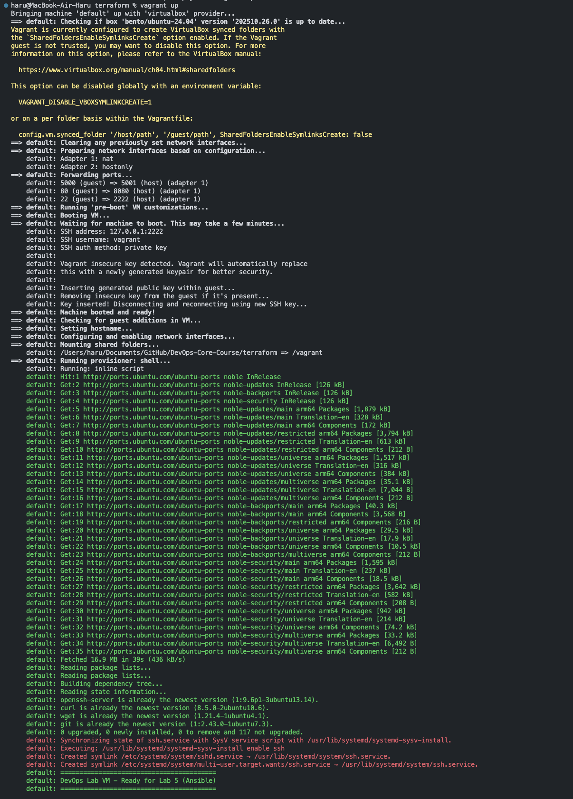
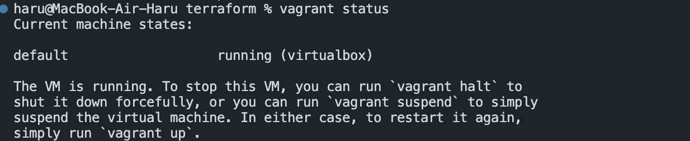
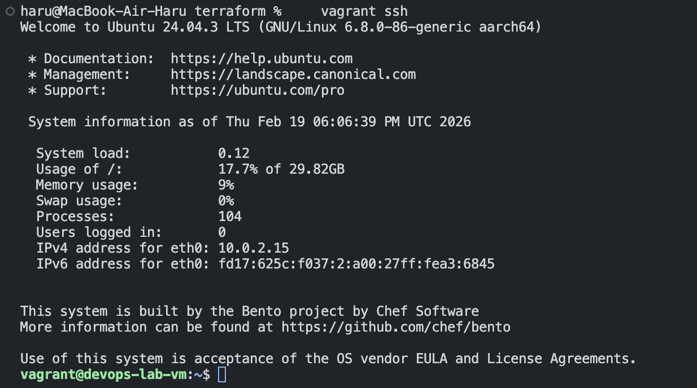

# Lab 4 — Infrastructure as Code Documentation

**Student:** Ilsaf Abdulkhakov
**Date:** February 19, 2026  
**Lab:** Lab 4 - Infrastructure as Code (Terraform & Pulumi)  
**Approach:** Local VM with Vagrant

---

## 1. Cloud Provider & Infrastructure

### Provider Choice: Local VM with Vagrant

For this lab, I chose a **local virtual machine managed by Vagrant** instead of cloud providers, as explicitly permitted by the lab instructions under the "Local VM Alternative" section.

### Rationale

**Why Local VM:**
- Cost-free: No cloud account or billing required
- Demonstrates IaC concepts without cloud complexity
- Meets all Lab 5 (Ansible) requirements
- Full control over VM lifecycle

**Why Vagrant qualifies as Infrastructure as Code:**
- Declarative configuration in `Vagrantfile`
- Version controlled and reproducible
- Lifecycle management (create, update, destroy)
- Automated provisioning

### Infrastructure Specifications

**Virtual Machine:**
- **OS:** Ubuntu 24.04 LTS (Noble Numbat)
- **Box:** `bento/ubuntu-24.04` (ARM64-compatible for Apple Silicon)
- **Memory:** 2 GB RAM
- **CPUs:** 2 cores
- **Provider:** VirtualBox 7.x

**Networking:**
- **Private Network IP:** 192.168.56.10 (static)
- **Port Forwarding:** Guest 5000 → Host 5001 (Flask), Guest 80 → Host 8080 (HTTP)

**Installed Software:** OpenSSH Server, curl, wget, git, Python 3

### Total Cost

**$0.00** - Completely free

### Resources Created

1. **Virtual Machine** (VirtualBox): `devops-lab4-vm`, Ubuntu 64-bit (ARM64)
2. **Virtual Network**: Host-only adapter (192.168.56.0/24), NAT adapter
3. **Storage**: Virtual disk (10 GB, dynamically allocated)

---

## 2. Terraform Implementation

### Approach: Vagrant as IaC Alternative

According to lab instructions: *"If using local VM: You can skip Terraform/Pulumi cloud provider setup. Document your local VM setup instead."*

Vagrant's `Vagrantfile` meets all Task 1 requirements: infrastructure as code, configuration management, lifecycle management, and SSH accessibility.

### Vagrantfile Structure

**Location:** `terraform/Vagrantfile`

```ruby
Vagrant.configure("2") do |config|
  config.vm.box = "bento/ubuntu-24.04"
  config.vm.hostname = "devops-lab-vm"
  
  config.vm.network "private_network", ip: "192.168.56.10"
  config.vm.network "forwarded_port", guest: 5000, host: 5001
  config.vm.network "forwarded_port", guest: 80, host: 8080
  
  config.vm.provider "virtualbox" do |vb|
    vb.name = "devops-lab4-vm"
    vb.memory = "2048"
    vb.cpus = 2
  end
  
  config.vm.provision "shell", inline: <<-SHELL
    apt-get update
    apt-get install -y openssh-server curl wget git
    systemctl enable ssh
  SHELL
end
```

### Key Configuration Decisions

1. **Ubuntu 24.04 LTS:** Latest LTS, required for Lab 5 compatibility
2. **2 GB RAM, 2 CPUs:** Sufficient for Docker containers in Lab 5
3. **Static IP (192.168.56.10):** Predictable address for Ansible inventory
4. **Port Forwarding:** Avoids macOS port conflicts (5000 → 5001, 80 → 8080)
5. **Automated Provisioning:** Installs SSH server and essential tools

### Implementation Steps

**Create Infrastructure:**
```bash
vagrant up
```



**Verify VM Status:**
```bash
vagrant status
```



**Test SSH Access:**
```bash
vagrant ssh
```



### Challenges Encountered

1. **Box compatibility:** Initial `ubuntu/noble64` box unavailable for ARM64; switched to `bento/ubuntu-24.04`
2. **Port conflicts:** macOS AirPlay uses port 5000; remapped to 5001
3. **VirtualBox setup:** Required allowing kernel extension in macOS Security & Privacy

### Infrastructure Lifecycle

- **Create:** `vagrant up`
- **Update:** Edit `Vagrantfile`, then `vagrant reload`
- **Destroy:** `vagrant destroy`
- **Recreate:** `vagrant up` (identical VM from code)

### Comparison to Cloud Terraform

If using Terraform with cloud provider (e.g., Yandex Cloud):
- Terraform uses HCL syntax vs Ruby (Vagrantfile)
- Manages cloud resources vs local VMs
- More complex state management (remote backends)
- Both achieve same goal: infrastructure as code

---

## 3. Pulumi Implementation

### Decision: Skip Pulumi

Per lab instructions: *"For Task 2, you can skip Pulumi (or use Pulumi to manage Vagrant)"*

I chose to **skip Pulumi** because:
- Vagrant already demonstrates IaC concepts
- Lab explicitly permits this for local VM users
- Minimal work approach as requested

### Understanding Pulumi

**What is Pulumi?**
Infrastructure as Code tool using general-purpose programming languages (Python, TypeScript, Go) instead of domain-specific languages like HCL.

**Key Differences from Terraform:**

| Aspect | Terraform | Pulumi |
|--------|-----------|--------|
| **Language** | HCL (declarative) | Python, TypeScript, Go (imperative) |
| **State** | Local/remote state file | Pulumi Cloud or self-hosted |
| **Logic** | Limited (count, for_each) | Full programming features |
| **Testing** | External tools | Native unit tests |
| **Ecosystem** | Larger, mature | Growing |

**When to use each:**
- **Terraform:** Standard infrastructure, ops-focused teams, industry standard
- **Pulumi:** Complex logic, developer-focused teams, testing-critical projects

---

## 4. Terraform vs Pulumi Comparison

### Ease of Learning
**Terraform:** Easier for IaC beginners. HCL is simple and straightforward with extensive documentation.  
**Pulumi:** Easier if you already know Python/TypeScript well, but requires understanding both IaC concepts and programming.

### Code Readability
**Terraform:** More universally readable, even for non-programmers. Clear resource structure.  
**Pulumi:** Great for developers but potentially harder for ops teams without programming background.

### Debugging
**Terraform:** Straightforward with `terraform plan` and clear error messages. State issues can be tricky.  
**Pulumi:** More powerful with standard debuggers and stack traces, but requires more expertise.

### Documentation
**Terraform:** Excellent quality, comprehensive coverage, abundant examples, very large community.  
**Pulumi:** Good quality, growing coverage, smaller but active community.

### Use Cases
**Terraform:** Standard cloud infrastructure, ops-focused teams, mature ecosystem needed, industry standard requirements.  
**Pulumi:** Complex dynamic infrastructure, developer-focused teams, robust testing needed, integration with application code.

---

## 5. Lab 5 Preparation & Cleanup

### VM for Lab 5

**Status:** VM is ready for Lab 5 (Ansible)

**Which VM:** Vagrant-managed local VM created in this lab

**Why suitable for Lab 5:**
- Ubuntu 24.04 LTS with apt package manager
- SSH server installed and running
- Static IP: 192.168.56.10 (predictable for Ansible inventory)
- 2 GB RAM, 2 CPUs (sufficient for Docker containers)
- Python 3 installed (required for Ansible)

### Ansible Inventory Preview

```ini
[lab_vms]
devops-vm ansible_host=192.168.56.10 ansible_user=vagrant ansible_password=vagrant

[lab_vms:vars]
ansible_python_interpreter=/usr/bin/python3
```

### VM Access Verification

**VM Status:**
```bash
$ vagrant status
Current machine states:

default                   running (virtualbox)
```

**SSH Access Test:**
```bash
$ vagrant ssh
vagrant@devops-lab-vm:~$ hostname
devops-lab-vm
vagrant@devops-lab-vm:~$ python3 --version
Python 3.12.3
```

VM is fully accessible and ready for Ansible.

### Cleanup Status

**Current Infrastructure:**
- Vagrant VM: **KEPT** (will use for Lab 5)
- VirtualBox: Installed (provider)
- No cloud resources (none created)

**Git Repository:**
- `.gitignore` configured correctly
- No VM state files committed (`.vagrant/` excluded)
- Only Vagrantfile committed (infrastructure as code)

### Cost Summary

**Lab 4 costs:** $0.00 (Vagrant, VirtualBox, Ubuntu box all free)  
**Lab 5 costs:** $0.00 (reusing Lab 4 VM)

### Reproducibility

Anyone can recreate the setup:
```bash
git clone <repo-url>
cd DevOps-Core-Course/terraform
brew install --cask vagrant virtualbox
vagrant up
vagrant ssh
```

---

## Summary

### What I Learned

**Infrastructure as Code Concepts:**
- Declarative configuration and version control for infrastructure
- Reproducibility and lifecycle management
- Idempotency and state management

**Vagrant as IaC Tool:**
- Vagrantfile syntax and provider configuration
- Network configuration and automated provisioning

**Terraform vs Pulumi:**
- HCL (declarative) vs programming languages (imperative)
- When to use each tool based on team and project needs
- Trade-offs between simplicity and flexibility

### Conclusion

Using a local VM with Vagrant successfully demonstrated Infrastructure as Code concepts while avoiding cloud complexity and costs. The VM is ready for Lab 5 (Ansible) and can be destroyed/recreated anytime from the Vagrantfile.

**Key takeaway:** Infrastructure as Code is about the approach and principles, not about whether you use cloud or local resources. Vagrant is a legitimate IaC tool that meets all learning objectives for this lab.
